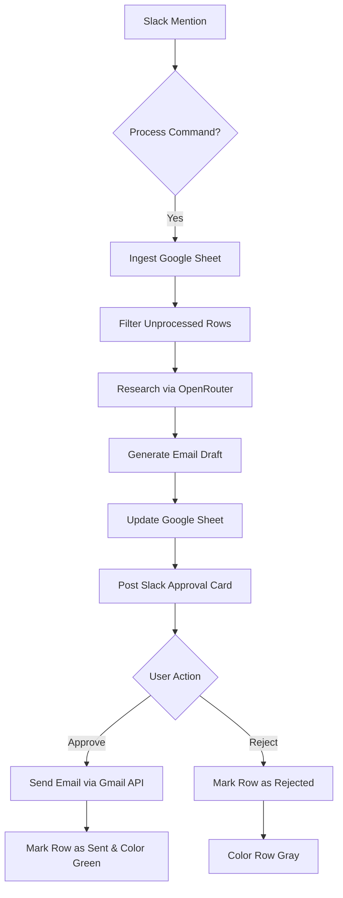

# 🚀 Jobify: Slack-Integrated Job Automation Agent

Jobify is a highly autonomous, interactive agent designed to handle the "heavy lifting" of job outreach. It transforms a list of companies in a Google Sheet into high-quality, personalized email drafts, all managed through a sleek Slack interface.

## 🧠 The Agentic Workflow

Jobify doesn't just run a script; it follows a multi-stage **Agentic Loop**:

1.  **Trigger & Ingest**: Mention `@Jobify process <URL>` in Slack. The agent scans your Google Sheet, identifies new prospects, and automatically skips anything already processed.
2.  **AI Research**: For every valid company, the agent performs deep-web research to understand their products, tech stack, and recent updates.
3.  **Personalized Drafting**: Using the research and your specific CV, the agent generates a custom email subject and body that feels human-written.
4.  **Human-in-the-Loop Approval**: The agent posts interactive cards to your Slack channel. You can Approve, Reject, or even edit the draft in the Google Sheet before sending.
5.  **Synchronized Persistence**: Every action you take in Slack is reflected back in the Google Sheet with visual color-coding (Green for Sent, Gray for Rejected/Skipped).

---

## 🛠️ How It Works (The Flow)



---

## ✨ What to Expect
-   **Zero Duplication**: The bot has a "Double-Lock" memory. It checks both the Google Sheet and a local database to ensure you never email the same company twice.
-   **Resilient Re-runs**: If you stop the bot and restart it with the same sheet, it will pick up exactly where it left off.
-   **OpenRouter Integration**: Uses high-performance models (`stepfun/step-3.5-flash:free`) to bypass direct API rate limits.
-   **Manual Control**: You can manually edit the Subject or Body in the Google Sheet, and the bot will send your *latest* version when you click "Approve" in Slack.

---

## 🚀 Complete Steps to Use

### 1. Prerequisites
-   Ensure you have a `.env` file with the following keys:
    -   `SLACK_BOT_TOKEN`, `SLACK_APP_TOKEN`, `SLACK_CHANNEL_ID`
    -   `OPENROUTER_API_KEY`
    -   `GOOGLE_SHEET_ID`, `CV_PATH`, `SENDING_GMAIL`

### 2. Start the Agent
Run the main Slack worker:
```powershell
python tools/slack_worker.py
```
*(Note: If it's your first time, a browser window will open for Google Authentication.)*

### 3. Trigger Processing
In your chosen Slack channel, mention the bot with a Google Sheet URL:
```text
@Jobify process https://docs.google.com/spreadsheets/d/your-sheet-id
```

### 4. Manage Approvals
-   **Real-time**: Cards will appear as soon as drafts are ready.
-   **Catch-up**: Use `@Jobify approvals` to see a list of every company waiting for your review.
-   **Actions**: 
    -   Click **Approve & Send** to mail the draft and update the sheet.
    -   Click **Reject** to skip the company and mark it as Rejected in the sheet.

---

## 📁 Key Files
-   `tools/slack_worker.py`: The "Brain" of the operation. Listens for commands and handles Slack UI.
-   `run_phase3.py`: The orchestrator that manages the ingest-research-draft loop.
-   `tools/research_company.py`: AI-powered research module.
-   `tools/generate_email.py`: AI-powered drafting module.
-   `tools/update_sheet.py`: Syncs your actions back to Google Sheets.
